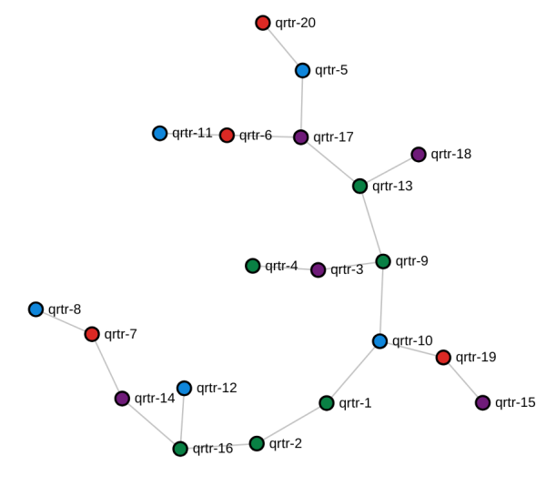

# k8s-topo
Arbitray network topology builder for network simulations inside Kubernetes. Analogous to [docker-topo](https://github.com/networkop/arista-ceos-topo). Relies on [meshnet CNI][meshnet-cni] plugin.

## TODO

1. Add logging
2. Save/archive action for device configs
3. Too many values are hard-coded like cpu/ram requests for different images. Need to expose all of them and make them configurable through external files/variables

## Local installation

Make sure you've got python3-dev and build-essential/build-base packages installed and then do

```
pip install git+https://github.com/networkop/k8s-topo.git
```

## Hosted K8s installation

Build the docker image and push it to the docker hub.

```
build.sh <dockerhub_username>
```

Update the image name in `kube-k8s-topo.yml` to match your dockerhub username and do:

```
kubectl create -f kube-k8s-topo.yml
```

# Visualisation
After the topology has been created, it is possible to view the resulting graph. The `k8s-topo --graph topology_name` command will create a json representation of the topology graph and feed it into a simple D3.js-based web page. This web page, running inside a `k8s-topo` pod, is exposed externally as a NodePort service on port **32080** of every node.



The colour of vertices represent the node the pod is running on. In this case the topology is spread across 4 different nodes.

# Private docker registry setup

It's possible to setup a private docker registry to speed up the image pull process and store cEOS images locally:

```
kubectl create -f examples/docker-registry/docker-registry.yml 
```

The private registry can be accessed by its cluster IP:

```
kubectl get service docker-registry
NAME              TYPE        CLUSTER-IP     EXTERNAL-IP   PORT(S)    AGE
docker-registry   ClusterIP   10.233.6.223   <none>        5000/TCP   10s
```

The following environment variable will be used by `k8s-topo` script to set the default cEOS image:

```
export CEOS_IMAGE=$(kubectl get service docker-registry -o json | jq -r '.spec.clusterIP'):5000/ceos:4.20.5F
```


Now we can upload the cEOS docker image to this registry:

```
docker import cEOS-4.20.5F-lab.tar.xz ceos:4.20.5F
docker image tag ceos:4.20.5F $CEOS_IMAGE
docker image push $CEOS_IMAGE 
The push refers to repository [10.233.6.223:5000/ceos]
7d3e293b5c56: Pushed 
4.20.5F: digest: sha256:caee130f23d25206ae5a3381c6c716b83fa12122f9a092ba99b09bd106c5f970 size: 529
```

This registry and cEOS image can now be used in the examples below

# Examples 

## Prerequisites

Working K8s cluster with meshnet-CNI and externally accessible private etcd cluster. Refer to [meshnet-cni][meshnet-cni] for setup scripts.

To use [vrnetlab] images, refer to this [guide](./vrnetlab.md)

## 3-node alpine linux topology

Topology definition file (alpine image is used whenever string `host` is matched in device name)

```yaml
etcd_port: 32379
links:
  - endpoints: ["host-1:eth1:12.12.12.1/24", "host-2:eth1:12.12.12.2/24"]
  - endpoints: ["host-1:eth2:13.13.13.1/24", "host-3:eth1:13.13.13.3/24"]
  - endpoints: ["host-2:eth2:23.23.23.2/24", "host-3:eth2:23.23.23.3/24"]
```

Create the topology

```bash
./bin/k8s-topo --create examples/3node-host.yml
```

List all pods in the topology

```
./bin/k8s-topo --show examples/3node-host.yml
host-1@node2
host-2@node2
host-3@node1
```

Test connectivity

```bash
kubectl exec -it host-1 -- ping -c 1 12.12.12.2
kubectl exec -it host-1 -- ping -c 1 13.13.13.3
kubectl exec -it host-2 -- ping -c 1 23.23.23.3
```

Destroy the topology

```bash
./bin/k8s-topo --destroy examples/3node-host.yml
```

## 3-node cEOS topology

Topology definition file (cEOS is stored in a private Docker registry)

```yaml
etcd_port: 32379
conf_dir: ./config-3node
links:
  - endpoints: ["sw-1:eth1", "sw-2:eth1"]
  - endpoints: ["sw-1:eth2", "sw-3:eth1"]
  - endpoints: ["sw-2:eth2", "sw-3:eth2"]
```

Create the topology

```bash
./bin/k8s-topo --create examples/3node-ceos.yml
```

List all pods in the topology

```bash
./bin/k8s-topo --show examples/3node-ceos.yml
sw-1@node1
sw-2@node1
sw-3@node1
```

Interact with any pod

```
/k8s-topo # sw-1
sw-1>en
sw-1#sh run 
! Command: show running-config
! device: sw-1 (cEOSSim, EOS-4.20.5F)
!
transceiver qsfp default-mode 4x10G
!
hostname sw-1
!
spanning-tree mode mstp
!
no aaa root
!
interface Ethernet1
   no switchport
   ip address 12.12.12.1/24
!
interface Ethernet2
   no switchport
   ip address 13.13.13.1/24
!
no ip routing
!
end
sw-1#ping  12.12.12.2
PING 12.12.12.2 (12.12.12.2) 72(100) bytes of data.
80 bytes from 12.12.12.2: icmp_seq=1 ttl=64 time=33.9 ms
80 bytes from 12.12.12.2: icmp_seq=2 ttl=64 time=10.2 ms
80 bytes from 12.12.12.2: icmp_seq=3 ttl=64 time=13.3 ms
80 bytes from 12.12.12.2: icmp_seq=4 ttl=64 time=13.2 ms
80 bytes from 12.12.12.2: icmp_seq=5 ttl=64 time=9.28 ms

--- 12.12.12.2 ping statistics ---
5 packets transmitted, 5 received, 0% packet loss, time 122ms
rtt min/avg/max/mdev = 9.280/16.004/33.929/9.105 ms, ipg/ewma 30.596/24.630 ms
sw-1#
```

Destroy the topology

```bash
./bin/k8s-topo --destroy examples/3node-ceos.yml
INFO:__main__:All pods have been destroyed successfully
INFO:__main__:
unalias sw-1
unalias sw-2
unalias sw-3
INFO:__main__:All data has been cleaned up from etcd
```

## 20-node random cEOS topology

Generate a random 20-node cEOS topology


```
./examples/builder/builder 20 0 --prefix sw
```

Create the topology (takes about 2 minutes)

```
./bin/k8s-topo --create examples/builder/random.yml
```

Enable ip forwarding inside cEOS containers

```
./bin/k8s-topo --eif examples/builder/random.yml
```

Generate the topology graph

```
./bin/k8s-topo --graph examples/builder/random.yml
INFO:__main__:D3 graph created
INFO:__main__:URL: http://10.83.30.251:30000
```

Check connectivity

```
/k8s-topo # kubectl exec -it sw-1 bash
/ # for i in `seq 0 20`; do echo "192.0.2.$i =>"  $(ping -c 1 -W 1 192.0.2.$i|grep loss); done
1 packets transmitted, 1 packets received, 0% packet loss
```

Destroy the topology

```bash
./bin/k8s-topo --destroy examples/builder/random.yml
```

## 750-node random Quagga router topology

> Note: max limit is 768 nodes, based on the available address space [reserved for documentation](https://tools.ietf.org/html/rfc5737) - '192.0.2.0/24', '198.51.100.0/24', '203.0.113.0/24'

Generate a random 750-node network topology

```
./examples/builder/builder 750 0
Total number of links generated: 749
```

Create the topology (takes about 2 minutes)

```
./bin/k8s-topo --create examples/builder/random.yml
```

Check connectivity (repeat for all loopback ranges - '192.0.2.0/24', '198.51.100.0/24', '203.0.113.0/24')

```
/k8s-topo # qrtr-143
/ # for i in `seq 0 255`; do echo "192.0.2.$i =>"  $(ping -c 1 -W 1 192.0.2.$i|grep loss); done
1 packets transmitted, 1 packets received, 0% packet loss
...
```

Destroy the topology

```bash
./bin/k8s-topo --destroy examples/builder/random.yml
```


# Troubleshooting

## Check the contents of etcd database

```
ETCD_HOST=$(kubectl get service etcd-client -o json |  jq -r '.spec.clusterIP')
ENDPOINTS=$ETCD_HOST:2379
ETCDCTL_API=3 etcdctl --endpoints=$ENDPOINTS get --prefix=true ""
ETCDCTL_API=3 etcdctl --endpoints=$ENDPOINTS get --prefix=true "/sw-9"
```

[meshnet-cni]: https://github.com/networkop/meshnet-cni
[vrnetlab]: https://github.com/plajjan/vrnetlab
